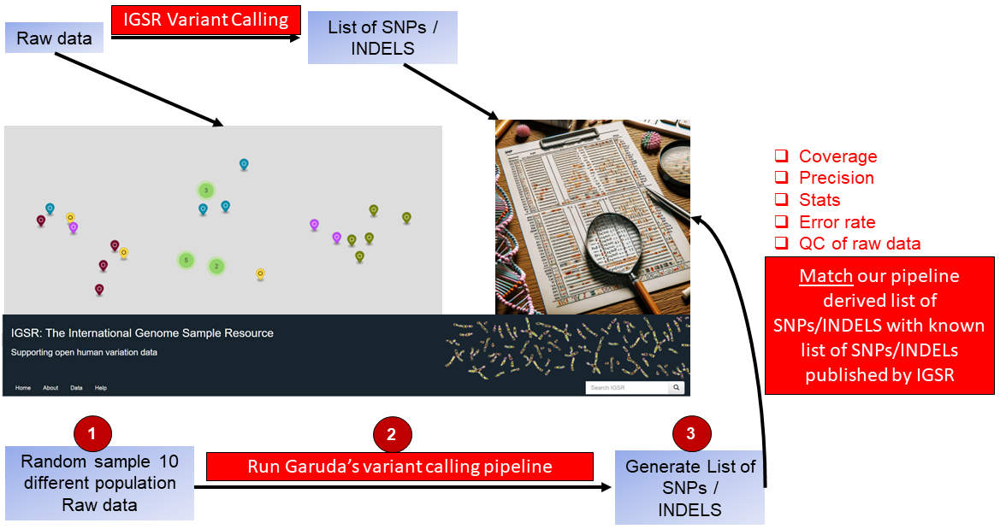
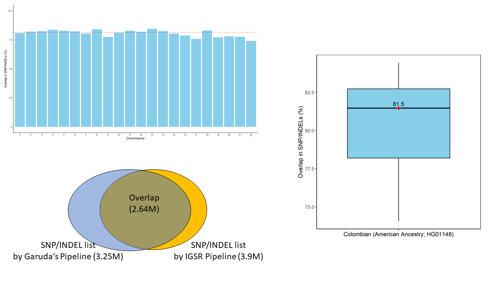

# WGS_variant_calling

* [Page 1: 2023-30-11](#id-section1). Chapter 1: WGS variant calling pipeline (Fastp, bwa & strelka2)

* [Page 2: 2024-15-01](#id-section2). Chapter 2: WGS variant calling qualification

-----
<div id='id-section1'/>


## Chapter 1: WGS variant calling pipeline

### A) fastp
fastp is a bioinformatics tool designed for the preprocessing and quality control of high-throughput sequencing data, particularly for Illumina sequencing platforms. It is an efficient and versatile tool that performs a variety of tasks, including adapter removal, quality filtering, and trimming of low-quality bases. The primary goal of fastp is to enhance the quality of raw sequencing data before downstream analysis, such as genome assembly, variant calling, or other bioinformatics applications.

```
/data/home/aayudh-das/fastp
-w 96                       # Use 96 CPU threads for parallel processing
--detect_adapter_for_pe     # Automatically detect and remove adapters for paired-end data
-W 4                        # Set the window size option shared by cut_front, cut_tail, or cut_sliding to 4
-M 20                       # Set the mean quality requirement option shared by cut_front, cut_tail, or cut_sliding to 20
--cut_by_quality3           # Trim low-quality bases from the 3' end of the read
--length_required 15        # Discard reads shorter than 15 bases
-i /data/home/aayudh-das/sop_test/GEB_0015_43A.R1.fastq.gz  # Input file for the first read pair
-o /data/home/aayudh-das/sop_test/GEB_0015_43A.R1.trimmed.fastq.gz  # Output file for the trimmed first read pair
-I /data/home/aayudh-das/sop_test/GEB_0015_43A.R2.fastq.gz  # Input file for the second read pair
-O /data/home/aayudh-das/sop_test/GEB_0015_43A.R2.trimmed.fastq.gz  # Output file for the trimmed second read pair
```
Explanation of options:

-w 96: This specifies the number of CPU threads to be used for parallel processing. Adjust this based on the available resources.
--detect_adapter_for_pe: Enables automatic detection and removal of adapters for paired-end data.
-W 4: Sets the window size option for quality control operations like cut_front, cut_tail, or cut_sliding to 4.
-M 20: Sets the mean quality requirement for quality control operations to 20.
--cut_by_quality3: Trims low-quality bases from the 3' end of the reads.
--length_required 15: Discards reads that are shorter than 15 bases.
-i and -I: Specify the input files for the first and second read pairs, respectively.
-o and -O: Specify the output files for the trimmed first and second read pairs, respectively.
The provided command is tailored for processing paired-end sequencing data (-i and -I options). It's essential to adjust parameters based on the specific characteristics of your sequencing data and quality requirements.

### B) bwa

BWA (Burrows-Wheeler Aligner) is a widely used bioinformatics tool for mapping DNA sequences against a large reference genome. It is particularly popular for its speed and accuracy in aligning short DNA sequences generated by high-throughput sequencing technologies like Illumina. Below is an overview of BWA and its main features:

Before doing the samples you need to index the hg19.fa
```
gzip -dc hg19.fa.gz > hg19.fa
sudo bwa index hg19.fa
```
Now do a sample
```
bwa mem -A 1 -B 4 -O 6,6 -E 1,1 -L 5,5 -U 17 hg19.fa GEB_0015_43A.R1.trimmed.fastq.gz GEB_0015_43A.R2.trimmed.fastq.gz> output.sam
samtools view -bS output.sam > output.bam
samtools sort output.bam -o sorted_output.bam
samtools index sorted_output.bam
samtools sort -o GEB_0015_43A.bam sorted_output.bam
samtools index GEB_0015_43A.bam
```
Explanation of options:
bwa mem
-R <attach read group information from sample metadata>
-A 1 # matching score
-B 4 # mismatch penalty
-O 6,6 # gap open penalty
-E 1,1 # gap extension penalty
-L 5,5 # clipping penalty
-U 17 # unpaired penalty

### C) dedup

```
sambamba markdup -t 72 -r --overflow-list-size=10000000 GEB_0015_43A.bam GEB_0015_43A.hg19.dedup.bam

sambamba markdup -t 72 -r --overflow-list-size=10000000 ICB0004_02CP11.bam ICB0004_02CP11.bam.hg19.dedup.bam
```

This command is a part of bioinformatics data analysis, specifically for processing BAM files, which are binary versions of Sequence Alignment/Map (SAM) files. These files contain information about the alignment of sequencing reads to reference genomes. The command you've provided uses sambamba markdup, a tool for marking duplicates in BAM files. Here's a breakdown of the command:

sambamba markdup: This is the command to invoke the Sambamba tool for marking duplicates. Sambamba is known for its efficiency in handling large genomic datasets.

-t 72: This option specifies the number of threads to be used for processing. In this case, it's set to 72, which means the command will try to use 72 CPU threads. This is useful for parallel processing and can significantly speed up the computation on systems with multiple cores.

-r: This flag tells Sambamba to remove duplicates. Instead of just marking them, it will actually delete the duplicate reads from the output file.

--overflow-list-size=10000000: This option sets the size of the overflow list. In the context of duplicate marking, an overflow list is used when in-memory data structures are insufficient to store all the necessary information. A larger list size can handle more reads but requires more memory.

GEB_0015_43A.bam: This is the input BAM file. It's the file you are processing to find and mark or remove duplicates.

GEB_0015_43A.hg19.dedup.bam: This is the output BAM file. It will contain the same data as the input file but with duplicates marked or removed, as specified.

### D) strelka2

Get a docker where you can run the strelka2. Remember that hg19.fa file needs to be indexed using samtools fdaix hg19.fa.

```
docker pull dceoy/strelka:latest

docker image ls

docker run --rm -v `pwd`:/work -w /work --entrypoint configureStrelkaSomaticWorkflow.py dceoy/strelka:latest --tumorBam GEB_0015_43A.hg19.dedup.bam --normalBam ICB0004_02CP11.bam.hg19.dedup.bam --referenceFasta hg19.fa --runDir /work

docker run --rm -v `pwd`:/work -w /work --entrypoint ./runWorkflow.py dceoy/strelka:latest -m local -j 32
```

to kill the job---

```
docker container rm -f 98b136db5ae0
```

**navigate strelka2 results**

```
root@ip-10-180-11-166:/data/home/aayudh-das/sop_test/results/variants# ll
total 30708
drwxr-xr-x 2 root root     4096 Mar  5 19:27 ./
drwxr-xr-x 4 root root     4096 Mar  5 18:51 ../
-rw-r--r-- 1 root root  5225243 Mar  5 19:27 somatic.indels.vcf.gz
-rw-r--r-- 1 root root   703508 Mar  5 19:27 somatic.indels.vcf.gz.tbi
-rw-r--r-- 1 root root 24001021 Mar  5 19:27 somatic.snvs.vcf.gz
-rw-r--r-- 1 root root  1501690 Mar  5 19:27 somatic.snvs.vcf.gz.tbi
root@ip-10-180-11-166:/data/home/aayudh-das/sop_test/results/variants#
```

### E) snpEff

snpEff: A tool used for annotating variants in VCF files and predicting their effects on genes (e.g., nonsynonymous coding changes, synonymous changes). It uses a database of genomic information to interpret the variants found in a VCF file based on the reference genome specified.

Download databases- 

**1. dbSNP** - ftp://ftp.ncbi.nlm.nih.gov/snp/organisms/human_9606_b150_GRCh37p13/VCF/GATK/common_all_20170710.vcf.gz

**2. gnomad_exomes**- https://hgdownload.soe.ucsc.edu/gbdb/hg19/gnomAD/vcf/

**YOU NEED TO INDEX EVERY DATABASE FILE**

```
tabix gnomad.genomes.r2.0.2.sites.w_AF.vcf.gz
```

#### SnpSift 

```
#!/bin/bash
# snpSift step run on both Strelka2 SNV and INDEL output VCFs ###################
  
bgzip -dc GEB_0015_43A_vs_ICB0004_02CP11_SNPs.vcf.gz |
        java -Xmx8g -jar /data/home/aayudh-das/snpEff/SnpSift.jar annotate -name dbsnp_ dbSNP.vcf.gz - |
        java -Xmx8g -jar /data/home/aayudh-das/snpEff/SnpSift.jar annotate -name gnomad_exomes_ gnomad.exomes.r2.0.2.sites.vcf.gz - |
        java -Xmx8g -jar /data/home/aayudh-das/snpEff/SnpSift.jar annotate -name gnomad_genomes_ gnomad.genomes.r2.0.2.sites.w_AF.vcf.gz - |
        bgzip -c > testdbsnp_gnomadExomes.vcf.gz
```

```
# snpEff step run on both Strelka2 SNV and INDEL outputs ##########################
snpEff <genome> <vcf input>
```


### Visualization

**Run wgs_script.py** to visualize various variants.

```
import pandas as pd
import matplotlib.pyplot as plt
import seaborn as sns
import numpy as np

# Set the working directory and list files (This step is manual in Python, make sure you're running this script in the desired directory or specify the path directly in file reading functions)

# Read the TSV file into a DataFrame
file_name = "GEB0017_571_vs_ICB0004_03CP11_filtered_oncoPanel.snp.tsv"
data1 = pd.read_csv(file_name, sep='\t', header=0)

# Manipulate 'coordinate' column
data1['coordinate'] = 'chr' + data1['chromosome'].astype(str) + ':' + data1['position'].astype(str) + '-' + data1['reference_allele'] + '>' + data1['alt_allele']

# Calculate VAF
data1['VAF'] = (data1['num_alt_obs'] / (data1['num_ref_obs'] + data1['num_alt_obs'])) * 100

# Reorder columns
cols = ['coordinate'] + [col for col in data1 if col != 'coordinate']
data = data1[cols]

# Remove duplicates and sort by 'coordinate'
data = data.drop_duplicates(subset=['coordinate']).sort_values(by=['coordinate'])

# Display the first few rows of the DataFrame
print(data.head())

# Create a pie chart based on the 'annotation' column
percentage_values = data['annotation'].value_counts(normalize=True) * 100
plt.figure(figsize=(10, 6))
data['annotation'].value_counts().plot.pie(autopct='%1.1f%%')
plt.title(f"{len(data)} SNPs")
plt.ylabel('')
plt.savefig("GEB0017_571_SNPs_piechart_intronic.png", format='png', dpi=300)
plt.close()

# Filter the data
percentage_data = pd.DataFrame(data['annotation'].value_counts(normalize=True) * 100).reset_index()
percentage_data.columns = ['Annotation', 'Percentage']
filtered_data = data[~data['annotation'].isin(["intron_variant", "downstream_gene_variant", "upstream_gene_variant", "synonymous_variant"])]

# Identify rare variants and clinical significance
filtered_data['rare_variant'] = np.where(
    (~filtered_data['gnomad_genomes_allele_freq'].isna() & (filtered_data['gnomad_genomes_allele_freq'] != ".")) |
    (~filtered_data['gnomad_exomes_allele_freq'].isna() & (filtered_data['gnomad_exomes_allele_freq'] != ".")),
    "RV", "")

filtered_data['clinvar'] = np.where(
    (~filtered_data['clinVar_clinical_significance'].isna() & (filtered_data['clinVar_clinical_significance'] != ".")) |
    (~filtered_data['clinVar_clinical_significance'].isna() & (filtered_data['clinVar_clinical_significance'] != ".")),
    "Cl", "")

# Save the filtered data to a CSV file
filtered_data.to_csv("GEB0017_571_SNPS_Intron_filtered_data.csv", index=False)

```
first part is making the coordinates-

| Coordinate        |
|-------------------|
| chr1:54708_G>C    |
| chr1:54716_C>T    |
| chr1:54753_T>G    |

***Now lets see the unfiltered data variants**


***Now visualize the filtered data**

```
import pandas as pd
import matplotlib.pyplot as plt
import seaborn as sns

# Load the CSV file into a DataFrame
data = pd.read_csv("GEB0017_571_SNPS_Intron_filtered_data.csv")

# Create a pie chart
plt.figure(figsize=(6, 6))
data['annotation'].value_counts().plot.pie(autopct='%1.1f%%', startangle=90)
plt.title(f"{data.shape[0]} SNPs")
plt.ylabel('')  # Hide the y-label
plt.savefig("GEB0017_571_SNPs_piechart.tiff", format='tiff', dpi=300)
plt.close()
```


***R script for barplot***

```
filtered_data <- read.csv("GEB0017_571_SNPS_Intron_filtered_data.csv")

tiff("SNPs_barplot.tiff", width = 20, height = 8, units = 'in', res = 300)
ggplot(filtered_data, aes(x = gene, y = frequency_of_alt, fill = gene)) +
  geom_bar(stat = "identity", position = "dodge", color = "black") +
  geom_text(aes(label = rare_variant),
            position = position_dodge(width = 0.9),
            vjust = 0.5,hjust=-0.2, angle =90,  # Adjust vertical position
            size = 5, family = "Arial") +
  geom_text(aes(label = annotation),
            position = position_dodge(width = 0.9),
            vjust = 0,hjust = 1,angle = 90,
            size = 3, family = "Arial")+
  geom_text(aes(label = clinvar),
            position = position_dodge(width = 0.9),
            vjust = 4.5,  # Adjust vertical position
            size = 4, family = "Arial", color = "red") +
  labs(title = NULL, x = NULL, y = "Frequency of Alternate Allele (%)") +
  theme_classic(base_family = "Arial") +
  guides(fill = FALSE) +
  geom_hline(yintercept = 10, linetype = "dashed", color = "black", size = 1)
dev.off()
```


-----
<div id='id-section2'/>


## Chapter 2: WGS qualification (variant calling-2a)



#### Samples-
**IGSR columnbian** - https://www.internationalgenome.org/data-portal/sample/HG01148
**IGSR limaperu** - https://www.internationalgenome.org/data-portal/sample/HG01953 

### Process IGSR variant lists 

1. Choose american ancestry based datasets from IGSR- https://www.internationalgenome.org/data-portal/sample/HG01148. Now extract the variants to servers for all 22 chromosomes. Now find out which column has the exact genotype. So, run this script **find_colno.sh** -

```
#!/bin/bash
  
# Define the file name
fileName="HG01148_Colombian_chr1.vcf.gz"

# Use zgrep to find the header line (which starts with #CHROM), then use awk to search for the specific column
columnNumber=$(zgrep -m1 "^#CHROM" $fileName | awk '{for(i=1;i<=NF;i++) if($i=="HG01953") print i}')

# Check if the column number was found and print the result
if [ -z "$columnNumber" ]; then
  echo "Header HG01953 not found."
else
  echo "Header HG01953 is in column number: $columnNumber"
fi
```
2. Now extract the CHROM, POS, ID, REF, ALT, Genotype_HG01148 from the vcf.gz files. In the script # Extract columns from the VCF, considering header lines and the 400th sample
    zcat $vcf_file | awk '{if(NR<=21 || $1 ~ /^#/) print; else print $1,$2,$3,$4,$5, $400}' > $extracted_columns ----in this line **change the "$400" to whatever column number** result you get from the **find_colno.sh**. Now execute this script- **1.extract_pos_IGSR.sh**

```
#!/bin/bash
  
# Loop through chromosomes 1-22
for chr in {1..22}; do
    # Define the VCF file name
    vcf_file="HG01148_Colombian_chr${chr}.vcf.gz"
    # Define intermediate and output file names
    extracted_columns="extracted_columns_chr${chr}.txt"
    filtered_output="filtered_output_chr${chr}.txt"
    final_output="final_output_chr${chr}.txt"
    header_file="header.txt"
    output_file="HG01148_Colombian_IGSR_chr${chr}.txt"

    # Extract columns from the VCF, considering header lines and the 400th sample
    zcat $vcf_file | awk '{if(NR<=21 || $1 ~ /^#/) print; else print $1,$2,$3,$4,$5, $400}' > $extracted_columns

    # Filter out VCF header lines
    grep -v "#" $extracted_columns > $filtered_output

    # Remove the first line (column names) from the filtered output
    tail -n +2 $filtered_output > $final_output

    # Create a new header file
    echo -e "CHROM\tPOS\tID\tREF\tALT\tGenotype_HG01148" > $header_file

    # Concatenate the new header with the final output
    cat $header_file $final_output > $output_file

    # Remove intermediate files
    rm $filtered_output $final_output $extracted_columns

    echo "Processed chromosome $chr."
done

echo "Processing complete for chromosomes 1-22."
```
3. Now this will create a table with all the columns info needed find out the coordinate. 

| CHROM | POS   | ID | REF | ALT | Genotype_HG01148 |
|-------|-------|----|-----|-----|------------------|
| 1     | 16103 | .  | T   | G   | 0\|0             |
| 1     | 17496 | .  | AC  | A   | 0\|0             |
| 1     | 51479 | .  | T   | A   | 0\|0             |

4. Now run script **2.coordinate_process.R** to form a 

```
#!/usr/bin/env Rscript
  
for (chr in 1:22) {
  file_name <- paste("HG01148_Colombian_IGSR_chr", chr, ".txt", sep = "")
  data <- read.table(file_name, header = TRUE, sep = "\t", stringsAsFactors = FALSE, fill = TRUE)

  # Splitting and processing data as per your script
  split_data <- strsplit(as.character(data$CHROM), " ")
  data$CHROM <- sapply(split_data, function(x) x[1])
  data$POS <- as.integer(sapply(split_data, function(x) x[2]))
  data$REF <- sapply(split_data, function(x) x[4])
  data$ALT <- sapply(split_data, function(x) x[5])
  data$Genotype <- sapply(split_data, function(x) x[6])
  data$ID <- NULL

  data$coordinate = gsub(" ", "", paste("chr", data$CHROM, ":", data$POS, "_", data$REF, ">", data$ALT))
  subset_df = subset(data, Genotype != "0|0")

  new_data <- data.frame(coordinate = subset_df$coordinate)

  # Generating a CSV file for each chromosome
  output_file_name <- paste("HG01148_Colombian_IGSR_coordinate_chr", chr, ".csv", sep = "")
  write.csv(new_data, output_file_name, row.names = FALSE)
}
```
Now each chromosome file (.csv) will have this- 
| Coordinate        |
|-------------------|
| chr1:54708_G>C    |
| chr1:54716_C>T    |
| chr1:54753_T>G    |

### Process IGSR WGS data in Basepair

Doenload the WGS files (fastq.gz) for the same genotype and run it in basepair with our variant callign pipeline. Then download them in baspepair -

```
wget -O file_name 
"https://basepair.s3.amazonaws.com/analyses/5389/118672/snpeff/HG01148_ERR022469.GRCh38.fi[…]ae8e89318882a16c00c69f5ad607b3a1fe7d8504d62cb90005c0d77f"
```
**YOU NEED TO DOWNLOAD the vcf.gx and the INDEX file vcf.gz.tbi**
1. First split the chromosomes with **bcftools**.

```
#!/bin/bash
  
# Define the input VCF file
input_vcf="SRR360540_HG01953_LimaPeru.hg19.variants.vcf.gz"

# Loop through chromosomes 1-22
for chr in {1..22}; do
    # Define the output file names
    output_vcf="SRR360540_HG01953_LimaPeru.hg19.chr${chr}.variants.vcf.gz"
    output_csv="chr${chr}_variants.csv"

    # Extract chromosome-specific variants and save to a new VCF file
    bcftools view -r chr${chr} $input_vcf -Oz -o $output_vcf

    # Query the chromosome-specific VCF to extract desired fields and save to a CSV file
    bcftools query -f '%CHROM,%POS,%REF,%ALT\n' $output_vcf > $output_csv
done

echo "Processing complete."
```
2. For each chromosomes now generate the coordinates.

```
#!/usr/bin/env Rscript
  
# Loop through chromosomes 1-22
for (chr in 1:22) {
  # Define input and output file names
  input_file <- paste0("chr", chr, "_variants.csv")
  output_file <- paste0("HG01953_LimaPeru_chr", chr, "_basepair_filtered.csv")

  # Load data from the CSV file
  data <- read.csv(input_file, sep = ",", header = FALSE)

  # Assign column names
  colnames(data) <- c("CHROM", "POS", "REF", "ALT")

  # Create a new column 'coordinate' with a specific format
  data$coordinate <- paste(data$CHROM, ":", data$POS, "_", data$REF, ">", data$ALT, sep = "")

  # Create a new data frame with only the 'coordinate' column
  new_data <- data.frame(coordinate = data$coordinate)

  # Write the new data frame to a CSV file
  write.csv(new_data, output_file, row.names = FALSE)
}

cat("Processing complete for chromosomes 1-22.\n")
```
Now each chromosome file (.csv) will have this- 
| Coordinate        |
|-------------------|
| chr1:54708_G>C    |
| chr1:54716_C>T    |
| chr1:54753_T>G    |

### Merging and statistics
**Now take both the IGSR and basepair derived files to one single folder**-

Run **3.merging_stats.R** script now.

```
#!/usr/bin/env Rscript

# Define the base pattern of file names
base_name <- "HG01953_LimaPeru_chr"

# Create a vector of chromosome numbers
chromosomes <- c(1:22) # Assuming you have chromosomes 1 through 22, X, and Y. Adjust if different.

# Loop through each chromosome number and read the corresponding file
for (chr in chromosomes) {
  # Construct the file name
  file_name <- paste0(base_name, chr, "_basepair_filtered.csv")

  # Construct the variable name
  var_name <- paste0("basepair_chr", chr)

  # Read the CSV file and assign it to a dynamic variable name
  assign(var_name, read.csv(file_name))
}

# Define the new base pattern of file names
base_name <- "HG01953_limaperu_IGSR_coordinate_chr"

# Create a vector of chromosome numbers
chromosomes <- 1:22 # Assuming you have chromosomes 1 through 22. Adjust if different.

# Loop through each chromosome number and read the corresponding file
for (chr in chromosomes) {
  # Construct the file name
  file_name <- paste0(base_name, chr, ".csv")

  # Construct the variable name
  var_name <- paste0("IGSR_chr", chr)

  # Read the CSV file and assign it to a dynamic variable name
  assign(var_name, read.csv(file_name))
}

# Initialize a vector to store percentage overlap for each chromosome
percent_overlaps <- numeric(22)

# Loop through chromosomes 1 through 22
for (chr in 1:22) {
  # Merge data frames for the current chromosome
  overlap <- merge(get(paste0("basepair_chr", chr)), get(paste0("IGSR_chr", chr)), by = "coordinate")

  # Calculate the percentage overlap
  percent_overlaps[chr] <- (nrow(overlap) / nrow(get(paste0("IGSR_chr", chr)))) * 100
}

# Create a data frame containing the percentage overlaps
chromosomes <- 1:22
overlap_data <- data.frame(chromosome = chromosomes, percent_overlap = percent_overlaps)

# Write the data frame to a CSV file
write.csv(overlap_data, "chromosome_overlap_percentage_IGSR.csv", row.names = FALSE)


# Initialize vectors to store the number of rows for overlap and basepair data frames
nrow_overlap <- numeric(22)
nrow_basepair <- numeric(22)
nrow_IGSR <- numeric(22)

# Loop through chromosomes 1 through 22
for (chr in 1:22) {
  # Merge data frames for the current chromosome
  overlap <- merge(get(paste0("basepair_chr", chr)), get(paste0("IGSR_chr", chr)), by = "coordinate")

  # Calculate the percentage overlap
  percent_overlaps[chr] <- (nrow(overlap) / nrow(get(paste0("basepair_chr", chr)))) * 100

  # Store the number of rows in overlap and basepair data frames
  nrow_overlap[chr] <- nrow(overlap)
  nrow_basepair[chr] <- nrow(get(paste0("basepair_chr", chr)))
  nrow_IGSR[chr] <- nrow(get(paste0("IGSR_chr", chr)))
}

# Create a data frame containing the chromosome numbers, percentage overlaps, and number of rows
chromosomes <- 1:22
overlap_data <- data.frame(chromosome = chromosomes,
                           percent_overlap = percent_overlaps,
                           nrow_overlap = nrow_overlap,
                           nrow_basepair = nrow_basepair,
                           nrow_IGSR = nrow_IGSR)

# Write the data frame to a CSV file
write.csv(overlap_data, "chromosome_overlap_details_HG01953_limaperu.csv", row.names = FALSE)
```
this will generate the dataset like this-

| chromosome | percent_overlap | nrow_overlap | nrow_basepair | nrow_IGSR |
|------------|-----------------|--------------|---------------|-----------|
| 1          | 80.589          | 200,820      | 249,189       | 299,986   |
| 2          | 81.805          | 227,763      | 278,423       | 335,755   |
| 3          | 82.250          | 187,751      | 228,270       | 276,693   |
| 4          | 83.485          | 204,397      | 244,831       | 298,252   |
| 5          | 82.624          | 159,653      | 193,229       | 222,950   |
| 6          | 81.976          | 168,722      | 205,818       | 245,617   |
| 7          | 80.167          | 149,816      | 186,881       | 228,924   |
| 8          | 83.808          | 148,678      | 177,404       | 224,516   |
| 9          | 77.245          | 106,268      | 137,573       | 150,113   |
| 10         | 80.860          | 137,352      | 169,865       | 209,131   |




-----
