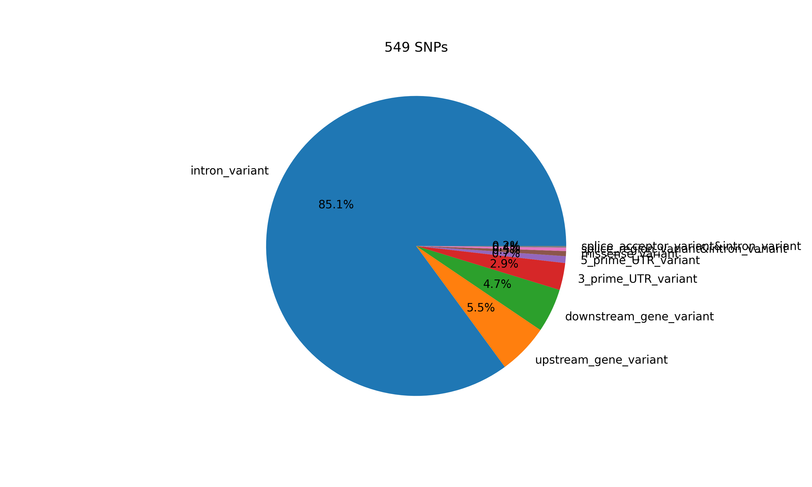
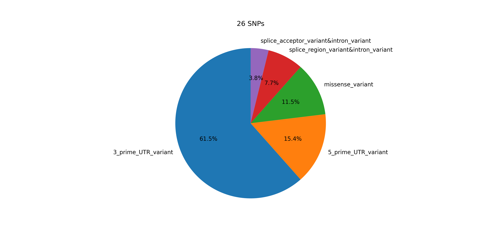
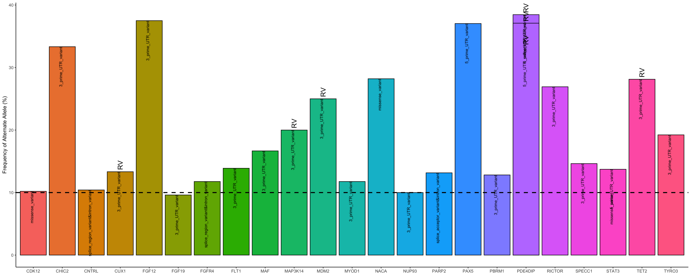

# WGS_variant_calling

* [Page 1: 2023-30-11](#id-section1). Chapter 1: WGS variant calling pipeline (Fastp, bwa & strelka2)

* [Page 2: 2024-15-01](#id-section3). Chapter 2: WGS variant calling qualification

-----
<div id='id-section1'/>


## Chapter 1: WGS variant calling pipeline

### A) fastp
fastp is a bioinformatics tool designed for the preprocessing and quality control of high-throughput sequencing data, particularly for Illumina sequencing platforms. It is an efficient and versatile tool that performs a variety of tasks, including adapter removal, quality filtering, and trimming of low-quality bases. The primary goal of fastp is to enhance the quality of raw sequencing data before downstream analysis, such as genome assembly, variant calling, or other bioinformatics applications.

```
/data/home/aayudh-das/fastp
-w 96                       # Use 96 CPU threads for parallel processing
--detect_adapter_for_pe     # Automatically detect and remove adapters for paired-end data
-W 4                        # Set the window size option shared by cut_front, cut_tail, or cut_sliding to 4
-M 20                       # Set the mean quality requirement option shared by cut_front, cut_tail, or cut_sliding to 20
--cut_by_quality3           # Trim low-quality bases from the 3' end of the read
--length_required 15        # Discard reads shorter than 15 bases
-i /data/home/aayudh-das/sop_test/GEB_0015_43A.R1.fastq.gz  # Input file for the first read pair
-o /data/home/aayudh-das/sop_test/GEB_0015_43A.R1.trimmed.fastq.gz  # Output file for the trimmed first read pair
-I /data/home/aayudh-das/sop_test/GEB_0015_43A.R2.fastq.gz  # Input file for the second read pair
-O /data/home/aayudh-das/sop_test/GEB_0015_43A.R2.trimmed.fastq.gz  # Output file for the trimmed second read pair
```
Explanation of options:

-w 96: This specifies the number of CPU threads to be used for parallel processing. Adjust this based on the available resources.
--detect_adapter_for_pe: Enables automatic detection and removal of adapters for paired-end data.
-W 4: Sets the window size option for quality control operations like cut_front, cut_tail, or cut_sliding to 4.
-M 20: Sets the mean quality requirement for quality control operations to 20.
--cut_by_quality3: Trims low-quality bases from the 3' end of the reads.
--length_required 15: Discards reads that are shorter than 15 bases.
-i and -I: Specify the input files for the first and second read pairs, respectively.
-o and -O: Specify the output files for the trimmed first and second read pairs, respectively.
The provided command is tailored for processing paired-end sequencing data (-i and -I options). It's essential to adjust parameters based on the specific characteristics of your sequencing data and quality requirements.

### B) bwa

BWA (Burrows-Wheeler Aligner) is a widely used bioinformatics tool for mapping DNA sequences against a large reference genome. It is particularly popular for its speed and accuracy in aligning short DNA sequences generated by high-throughput sequencing technologies like Illumina. Below is an overview of BWA and its main features:

Before doing the samples you need to index the hg19.fa
```
gzip -dc hg19.fa.gz > hg19.fa
sudo bwa index hg19.fa
```
Now do a sample
```
bwa mem -A 1 -B 4 -O 6,6 -E 1,1 -L 5,5 -U 17 hg19.fa GEB_0015_43A.R1.trimmed.fastq.gz GEB_0015_43A.R2.trimmed.fastq.gz> output.sam
samtools view -bS output.sam > output.bam
samtools sort output.bam -o sorted_output.bam
samtools index sorted_output.bam
samtools sort -o GEB_0015_43A.bam sorted_output.bam
samtools index GEB_0015_43A.bam
```
Explanation of options:
bwa mem
-R <attach read group information from sample metadata>
-A 1 # matching score
-B 4 # mismatch penalty
-O 6,6 # gap open penalty
-E 1,1 # gap extension penalty
-L 5,5 # clipping penalty
-U 17 # unpaired penalty

### C) dedup

```
sambamba markdup -t 72 -r --overflow-list-size=10000000 GEB_0015_43A.bam GEB_0015_43A.hg19.dedup.bam

sambamba markdup -t 72 -r --overflow-list-size=10000000 ICB0004_02CP11.bam ICB0004_02CP11.bam.hg19.dedup.bam
```

This command is a part of bioinformatics data analysis, specifically for processing BAM files, which are binary versions of Sequence Alignment/Map (SAM) files. These files contain information about the alignment of sequencing reads to reference genomes. The command you've provided uses sambamba markdup, a tool for marking duplicates in BAM files. Here's a breakdown of the command:

sambamba markdup: This is the command to invoke the Sambamba tool for marking duplicates. Sambamba is known for its efficiency in handling large genomic datasets.

-t 72: This option specifies the number of threads to be used for processing. In this case, it's set to 72, which means the command will try to use 72 CPU threads. This is useful for parallel processing and can significantly speed up the computation on systems with multiple cores.

-r: This flag tells Sambamba to remove duplicates. Instead of just marking them, it will actually delete the duplicate reads from the output file.

--overflow-list-size=10000000: This option sets the size of the overflow list. In the context of duplicate marking, an overflow list is used when in-memory data structures are insufficient to store all the necessary information. A larger list size can handle more reads but requires more memory.

GEB_0015_43A.bam: This is the input BAM file. It's the file you are processing to find and mark or remove duplicates.

GEB_0015_43A.hg19.dedup.bam: This is the output BAM file. It will contain the same data as the input file but with duplicates marked or removed, as specified.

### D) strelka2

Get a docker where you can run the strelka2. Remember that hg19.fa file needs to be indexed using samtools fdaix hg19.fa.

```
docker pull dceoy/strelka:latest

docker image ls

docker run --rm -v `pwd`:/work -w /work --entrypoint configureStrelkaSomaticWorkflow.py dceoy/strelka:latest --tumorBam GEB_0015_43A.hg19.dedup.bam --normalBam ICB0004_02CP11.bam.hg19.dedup.bam --referenceFasta hg19.fa --runDir /work

docker run --rm -v `pwd`:/work -w /work --entrypoint ./runWorkflow.py dceoy/strelka:latest -m local -j 32
```

to kill the job---

```
docker container rm -f 98b136db5ae0
```

**navigate strelka2 results**

```
root@ip-10-180-11-166:/data/home/aayudh-das/sop_test/results/variants# ll
total 30708
drwxr-xr-x 2 root root     4096 Mar  5 19:27 ./
drwxr-xr-x 4 root root     4096 Mar  5 18:51 ../
-rw-r--r-- 1 root root  5225243 Mar  5 19:27 somatic.indels.vcf.gz
-rw-r--r-- 1 root root   703508 Mar  5 19:27 somatic.indels.vcf.gz.tbi
-rw-r--r-- 1 root root 24001021 Mar  5 19:27 somatic.snvs.vcf.gz
-rw-r--r-- 1 root root  1501690 Mar  5 19:27 somatic.snvs.vcf.gz.tbi
root@ip-10-180-11-166:/data/home/aayudh-das/sop_test/results/variants#
```

### E) snpEff

snpEff: A tool used for annotating variants in VCF files and predicting their effects on genes (e.g., nonsynonymous coding changes, synonymous changes). It uses a database of genomic information to interpret the variants found in a VCF file based on the reference genome specified.

```
# snpSift step run on both Strelka2 SNV and INDEL output VCFs ###################
bgzip -dc <vcf input> |
java -Xmx8g -jar SnpSift.jar annotate
-name dbsnp_
<dbSNP database> - |
java -Xmx8g -jar SnpSift.jar annotate
-name gnomad_genomes_
<gnomad genomes database> - |
java -Xmx8g -jar SnpSift.jar annotate
-name gnomad_exomes_
<gnomad exomes database - |
bgzip -c

# snpEff step run on both Strelka2 SNV and INDEL outputs ##########################
snpEff <genome> <vcf input>
```


### Visualization

**Run wgs_script.py** to visualize various variants.

```
import pandas as pd
import matplotlib.pyplot as plt
import seaborn as sns
import numpy as np

# Set the working directory and list files (This step is manual in Python, make sure you're running this script in the desired directory or specify the path directly in file reading functions)

# Read the TSV file into a DataFrame
file_name = "GEB0017_571_vs_ICB0004_03CP11_filtered_oncoPanel.snp.tsv"
data1 = pd.read_csv(file_name, sep='\t', header=0)

# Manipulate 'coordinate' column
data1['coordinate'] = 'chr' + data1['chromosome'].astype(str) + ':' + data1['position'].astype(str) + '-' + data1['reference_allele'] + '>' + data1['alt_allele']

# Calculate VAF
data1['VAF'] = (data1['num_alt_obs'] / (data1['num_ref_obs'] + data1['num_alt_obs'])) * 100

# Reorder columns
cols = ['coordinate'] + [col for col in data1 if col != 'coordinate']
data = data1[cols]

# Remove duplicates and sort by 'coordinate'
data = data.drop_duplicates(subset=['coordinate']).sort_values(by=['coordinate'])

# Display the first few rows of the DataFrame
print(data.head())

# Create a pie chart based on the 'annotation' column
percentage_values = data['annotation'].value_counts(normalize=True) * 100
plt.figure(figsize=(10, 6))
data['annotation'].value_counts().plot.pie(autopct='%1.1f%%')
plt.title(f"{len(data)} SNPs")
plt.ylabel('')
plt.savefig("GEB0017_571_SNPs_piechart_intronic.png", format='png', dpi=300)
plt.close()

# Filter the data
percentage_data = pd.DataFrame(data['annotation'].value_counts(normalize=True) * 100).reset_index()
percentage_data.columns = ['Annotation', 'Percentage']
filtered_data = data[~data['annotation'].isin(["intron_variant", "downstream_gene_variant", "upstream_gene_variant", "synonymous_variant"])]

# Identify rare variants and clinical significance
filtered_data['rare_variant'] = np.where(
    (~filtered_data['gnomad_genomes_allele_freq'].isna() & (filtered_data['gnomad_genomes_allele_freq'] != ".")) |
    (~filtered_data['gnomad_exomes_allele_freq'].isna() & (filtered_data['gnomad_exomes_allele_freq'] != ".")),
    "RV", "")

filtered_data['clinvar'] = np.where(
    (~filtered_data['clinVar_clinical_significance'].isna() & (filtered_data['clinVar_clinical_significance'] != ".")) |
    (~filtered_data['clinVar_clinical_significance'].isna() & (filtered_data['clinVar_clinical_significance'] != ".")),
    "Cl", "")

# Save the filtered data to a CSV file
filtered_data.to_csv("GEB0017_571_SNPS_Intron_filtered_data.csv", index=False)

```
first part is making the coordinates-

| Coordinate        |
|-------------------|
| chr1:54708_G>C    |
| chr1:54716_C>T    |
| chr1:54753_T>G    |




***Now visualize the filtered data**

```
import pandas as pd
import matplotlib.pyplot as plt
import seaborn as sns

# Load the CSV file into a DataFrame
data = pd.read_csv("GEB0017_571_SNPS_Intron_filtered_data.csv")

# Create a pie chart
plt.figure(figsize=(6, 6))
data['annotation'].value_counts().plot.pie(autopct='%1.1f%%', startangle=90)
plt.title(f"{data.shape[0]} SNPs")
plt.ylabel('')  # Hide the y-label
plt.savefig("GEB0017_571_SNPs_piechart.tiff", format='tiff', dpi=300)
plt.close()
```



***R script for barplot***

```
filtered_data <- read.csv("GEB0017_571_SNPS_Intron_filtered_data.csv")

tiff("SNPs_barplot.tiff", width = 20, height = 8, units = 'in', res = 300)
ggplot(filtered_data, aes(x = gene, y = frequency_of_alt, fill = gene)) +
  geom_bar(stat = "identity", position = "dodge", color = "black") +
  geom_text(aes(label = rare_variant),
            position = position_dodge(width = 0.9),
            vjust = 0.5,hjust=-0.2, angle =90,  # Adjust vertical position
            size = 5, family = "Arial") +
  geom_text(aes(label = annotation),
            position = position_dodge(width = 0.9),
            vjust = 0,hjust = 1,angle = 90,
            size = 3, family = "Arial")+
  geom_text(aes(label = clinvar),
            position = position_dodge(width = 0.9),
            vjust = 4.5,  # Adjust vertical position
            size = 4, family = "Arial", color = "red") +
  labs(title = NULL, x = NULL, y = "Frequency of Alternate Allele (%)") +
  theme_classic(base_family = "Arial") +
  guides(fill = FALSE) +
  geom_hline(yintercept = 10, linetype = "dashed", color = "black", size = 1)
dev.off()
```

